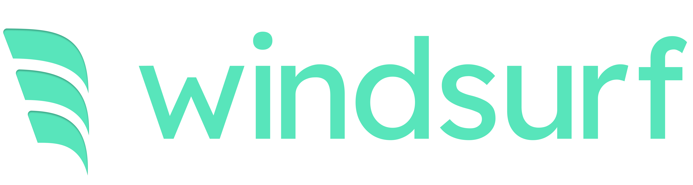

# 

A curated hub of resources, tips, and community-driven content for Windsurf - a very nice agentic IDE made by [Codeium](https://codeium.com).

## Contents

- [Please Read](#please-read)
- [Community Prompts](#community-prompts)
- [Known Issues & Solutions](#known-issues--solutions)
- [Tips and Tricks](#tips-and-tricks)
- [Themes](#themes)
- [Troubleshooting](#troubleshooting)
- [Community](#community)
- [License](#license)

## Please Read

This is not an official Codeium repository. For official documentation and support, please visit:

- [Codeium Documentation](https://codeium.com/documentation)
- [Codeium Changelog](https://codeium.com/changelog)
- [Join Codeium Discord](https://discord.gg/3XFf78nAx5)

## Community Prompts

This repository includes a collection of community-contributed prompts that enhance Windsurf's capabilities. Each contributor has their own directory under `prompts/` to maintain organization:

### Current Contributors

- [@computerk](prompts/computerk/)
  - [Global Rules](prompts/computerk/global-rules.md) - A comprehensive set of coding guidelines

Want to contribute? Create a directory with your username and add your prompts! See the [Contributing](#contributing) section for more details.

## Known Issues & Solutions

| Issue | Description | Solution |
|-------|-------------|----------|
| Special Characters | Chat messages with special characters may cause test failures | Use custom Jest reporter that handles special characters: 1. Install reporter package 2. Configure Jest to use it 3. Run tests with --reporters flag |
| Credit System & Downtime | Credits may be consumed during service interruptions or failed flows | Currently no built-in way to track or reimburse lost credits. Consider: 1. Document failed flows with timestamps 2. Contact support for significant issues 3. Request status page or real-time service health indicators |

## Feature Requests

Have a feature idea for Windsurf? Please submit it on the official feature request page:
[Windsurf Feature Requests](https://codeium.canny.io/feature-requests)

## Tips and Tricks

- Check the status pages mentioned above before debugging local issues
- Bookmark both pages for quick access during incidents

## Themes

### Default Themes

Coming soon - Share your favorite themes with the community!

## Troubleshooting

### Common Issues

Coming soon - We will collect common issues and their solutions here.

## Contributing

Want to contribute? Great! Please check our [contributing guidelines](CONTRIBUTING.md) for details on how to add your contributions.

## License

This list is dedicated to the public domain under the [CC0 1.0 Universal](https://creativecommons.org/publicdomain/zero/1.0/) license.
